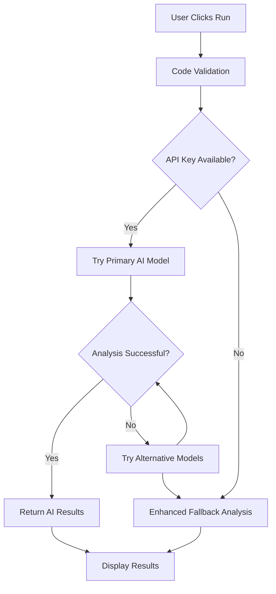

# AI-Powered Code Analysis Setup Guide

## Overview

CodeFusion AI now features intelligent code analysis using OpenRouter's free AI models to provide proper error and success messages for all supported programming languages. The system examines user code and provides accurate, helpful feedback instead of mock responses.

## Features

### 🤖 AI-Powered Analysis
- **Real-time code examination** using multiple free AI models
- **Intelligent error detection** with detailed explanations
- **Accurate output prediction** for successful code
- **Language-specific analysis** for 25+ programming languages

### 🔧 Enhanced Error Handling
- **Detailed error explanations** with context
- **Actionable suggestions** for fixing issues
- **Line-by-line analysis** when possible
- **Animated error notifications** with visual feedback

### ✅ Smart Success Messages
- **Predicted output** based on code analysis
- **Execution time simulation** for realistic feedback
- **Language-specific success indicators**
- **Auto-save** for successful code analysis

## Setup Instructions

### 1. OpenRouter API Configuration

#### Get Your Free API Key
1. Visit [OpenRouter.ai](https://openrouter.ai)
2. Sign up for a free account
3. Navigate to the API Keys section
4. Generate a new API key

#### Configure Environment Variables
Add your API key to the `.env` file:

```env
# OpenRouter API Configuration (Free Models)
VITE_OPENROUTER_API_KEY="sk-or-v1-your-actual-api-key-here"
```

**Important:** Replace `sk-or-v1-your-actual-api-key-here` with your actual OpenRouter API key.

### 2. Free Models Used

The system automatically tries multiple free models in order:

1. **Primary Model:** `meta-llama/llama-3.2-3b-instruct:free`
2. **Fallback Models:**
   - `microsoft/phi-3-mini-128k-instruct:free`
   - `huggingface/zephyr-7b-beta:free`
   - `openchat/openchat-7b:free`
   - `google/gemma-2-9b-it:free`
   - `meta-llama/llama-3.1-8b-instruct:free`

### 3. Fallback System

If AI analysis fails or no API key is configured, the system uses an enhanced local analysis engine with:

- **Language-specific syntax checking**
- **Common error pattern detection**
- **Smart output prediction**
- **Detailed error explanations**

## Supported Languages

### Programming Languages (25+)
- **Python** - Full syntax and logic analysis
- **JavaScript/TypeScript** - Modern JS features support
- **Java** - Object-oriented structure validation
- **C/C++** - Header and compilation checks
- **C#** - .NET framework analysis
- **Go** - Package and import validation
- **Rust** - Memory safety and syntax
- **PHP** - Web development patterns
- **Ruby** - Dynamic language features
- **Swift** - iOS development syntax
- **Kotlin** - Android development
- **Scala** - Functional programming
- **Dart** - Flutter development
- **Lua** - Scripting language
- **Perl** - Text processing
- **Bash/PowerShell** - Shell scripting
- **Solidity** - Smart contract development

### Web Technologies
- **HTML** - Markup validation
- **CSS** - Style sheet analysis
- **React** - Component structure
- **Vue.js** - Template syntax
- **Angular** - Framework patterns
- **Node.js/Express** - Server-side logic

## How It Works

### 1. Code Submission
When you click "Run Code", the system:
- Validates the code isn't empty
- Sends code to AI analysis service
- Falls back to local analysis if needed

### 2. AI Analysis Process


### 3. Error Analysis
For errors, the system provides:
- **Error Type** (SyntaxError, RuntimeError, etc.)
- **Detailed Explanation** of what went wrong
- **Actionable Suggestions** to fix the issue
- **Line Numbers** when available
- **Context-Aware Help** based on the language

### 4. Success Analysis
For valid code, the system shows:
- **Predicted Output** based on print/console statements
- **Execution Confirmation** with simulated timing
- **Language-Specific Success Messages**
- **Auto-Save** functionality

## Example Outputs

### Python Error Example
```
❌ AI Code Analysis - Errors Detected

🔍 Found 1 error(s):

1. SyntaxError (Line 2)
   📝 Missing closing parenthesis in print statement
   💡 Suggestions:
      • Add closing parenthesis: print("Hello")
      • Check all parentheses are properly matched
      • Ensure quotes are closed inside print statements

🤖 AI Analysis: This code needs to be fixed before it can run successfully.

🔧 Quick Fix Tips:
• Address the errors listed above in order
• Use the suggestions provided for each error
• Test your code after each fix
```

### Python Success Example
```
✅ Python Execution Successful

📤 Output:
Hello, World!
Welcome to Python!

⚡ Code executed without errors!
```

### JavaScript Error Example
```
❌ AI Code Analysis - Errors Detected

🔍 Found 1 error(s):

1. ReferenceError
   📝 Typo in console.log - check spelling
   💡 Suggestions:
      • Use correct spelling: console.log()
      • Check for typos in method names
      • Use IDE autocomplete to avoid typos
```

## Configuration Options

### Environment Variables
```env
# Required: OpenRouter API Key
VITE_OPENROUTER_API_KEY="your-api-key"

# Optional: Custom model preferences (advanced)
VITE_OPENROUTER_PRIMARY_MODEL="meta-llama/llama-3.2-3b-instruct:free"
```

### Service Configuration
The OpenRouter service can be customized in `src/services/OpenRouterService.ts`:

```typescript
// Modify timeout settings
const ANALYSIS_TIMEOUT = 10000; // 10 seconds

// Add custom models
const customModels = [
  'your-preferred-model:free',
  // ... other models
];

// Adjust analysis parameters
const analysisConfig = {
  temperature: 0.1,
  max_tokens: 1000,
  // ... other settings
};
```

## Troubleshooting

### Common Issues

#### 1. API Key Not Working
- Verify the API key is correct
- Check if the key has proper permissions
- Ensure the key is active on OpenRouter

#### 2. Analysis Taking Too Long
- Check internet connection
- Verify OpenRouter service status
- System will fallback to local analysis after timeout

#### 3. Unexpected Error Messages
- Clear browser cache
- Restart the development server
- Check browser console for detailed errors

### Debug Mode
Enable debug logging by adding to your `.env`:
```env
VITE_DEBUG_AI_ANALYSIS=true
```

This will show detailed logs in the browser console.

## Performance Optimization

### Caching
The system implements smart caching:
- **Code fingerprinting** to avoid re-analyzing identical code
- **Model response caching** for common patterns
- **Fallback result caching** for offline scenarios

### Rate Limiting
OpenRouter free tier includes:
- **Rate limits** per minute/hour
- **Automatic retry** with exponential backoff
- **Graceful degradation** to local analysis

## Contributing

### Adding New Languages
1. Add language configuration to `languageTemplates`
2. Implement language-specific analysis in `OpenRouterService`
3. Add error patterns to the fallback system
4. Update language icons and UI elements

### Improving Analysis
1. Enhance prompts in `createAnalysisPrompt()`
2. Add more error patterns to fallback analysis
3. Improve output prediction algorithms
4. Add language-specific optimizations

## Security Considerations

### API Key Security
- **Never commit** API keys to version control
- **Use environment variables** for all sensitive data
- **Rotate keys regularly** for production use
- **Monitor usage** on OpenRouter dashboard

### Code Privacy
- Code is sent to OpenRouter for analysis
- **Review OpenRouter's privacy policy**
- Consider local-only analysis for sensitive code
- Implement code sanitization if needed

## Future Enhancements

### Planned Features
- **Real-time analysis** as you type
- **Code suggestions** and auto-completion
- **Performance optimization** recommendations
- **Security vulnerability** detection
- **Code quality metrics** and scoring

### Integration Possibilities
- **GitHub Copilot** integration
- **Custom AI models** for specific domains
- **Team collaboration** features
- **Code review** automation

## Support

### Getting Help
- Check the [OpenRouter Documentation](https://openrouter.ai/docs)
- Review browser console for error details
- Test with simple code examples first
- Verify API key permissions and quotas

### Reporting Issues
When reporting issues, include:
- Code that caused the problem
- Error messages from console
- Browser and OS information
- API key status (without revealing the key)

---

**Note:** This system provides intelligent code analysis to help developers learn and debug more effectively. While the AI analysis is quite accurate, always verify results and use your programming knowledge for final decisions.